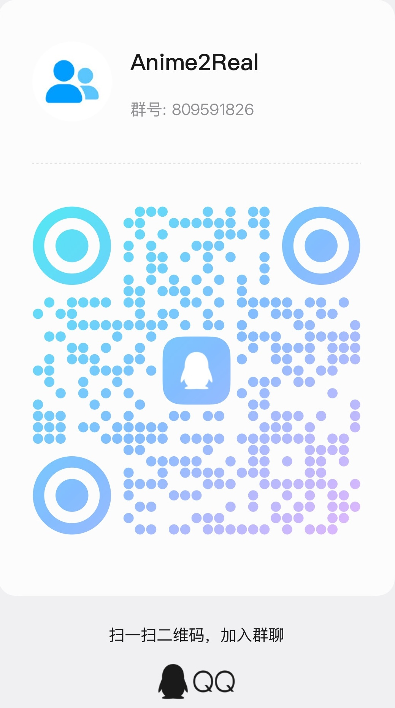

# Anime2Real

**打破次元壁！次元の壁を超える！**

通过 AI 技术把二次元角色带到现实。

当前旗舰项目是《人形电脑天使心》(Chobits) 中的 **小叽 (Chii / ちぃ)** —— 从语音数据集、声音克隆、对话模型到桌面精灵的完整开源链路。

## 项目一览

### 数据集

| 仓库 | 简介 |
| --- | --- |
| [Chobits-Chii-Voice](https://github.com/Anime2Real/Chobits-Chii-Voice) | 小叽语音数据集（CV: 田中理惠）：TV 全 24 话提取，487 段约 21.4 分钟，人工标注 + 全量复听 · [🤗 Dataset](https://huggingface.co/datasets/chenxin199305/Chobits-Chii-Voice) |

### 模型与服务

| 仓库 | 简介 |
| --- | --- |
| [Chobits-Chii-TTS](https://github.com/Anime2Real/Chobits-Chii-TTS) | 小叽语音合成模型：GPT-SoVITS v2Pro 微调，权重已发布 · [🤗 Model](https://huggingface.co/chenxin199305/Chobits-Chii-TTS) |
| [Chobits-Chii-ASR](https://github.com/Anime2Real/Chobits-Chii-ASR) | 小叽语音识别服务：Fun-ASR-Nano-2512 部署 + OpenAI 兼容门面，预留 Qwen3-ASR 切换 |

### 应用

| 仓库 | 简介 |
| --- | --- |
| [Chobits-Chii-Mascot-Release](https://github.com/Anime2Real/Chobits-Chii-Mascot-Release) | AI 桌面精灵「小叽」的公开发布渠道：Release 产物与自动更新元数据 |

## 交流群

欢迎加入 QQ 群 **Anime2Real**（群号：809591826），扫码即可加入：

## 声明

原始动画及音频的版权归其权利方所有。本组织下的所有项目仅供学习与研究使用，请勿用于商业用途。
